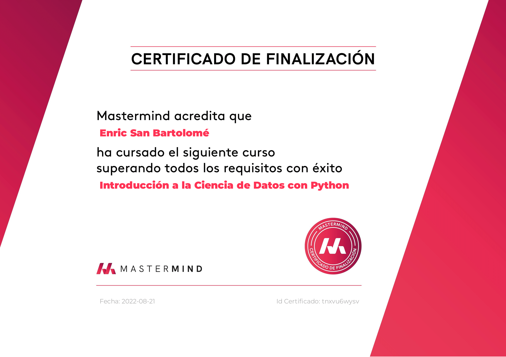

#  Introduction to Data Science with Python

[Course Link - Introduction to Data Science with Python](https://www.mastermind.ac/courses/intro-datascience)

---

This course shows the basic knowledge of Data Science programming skills.

Skills practiced in this course:

1. Jupyter Notebook (IDE)
2. Most common libraries used for Data Science:
    1. Numpy
    2. Pandas
    3. Matplotlib
3. Data Cleaning
    1. Revoming duplicated
    2. Treat with NaN
4. EDA (Exploratory Data Analysis)
5. Visualization

Final project (:file_folder: / Proyecto_final) of this course is an EDA of a Pokémon dataset. A lot of interesting questions about this video game have been solved with cool graphs.

---
# :trophy: Certificate

